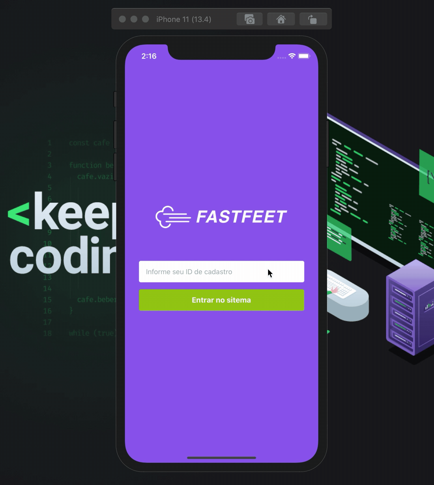
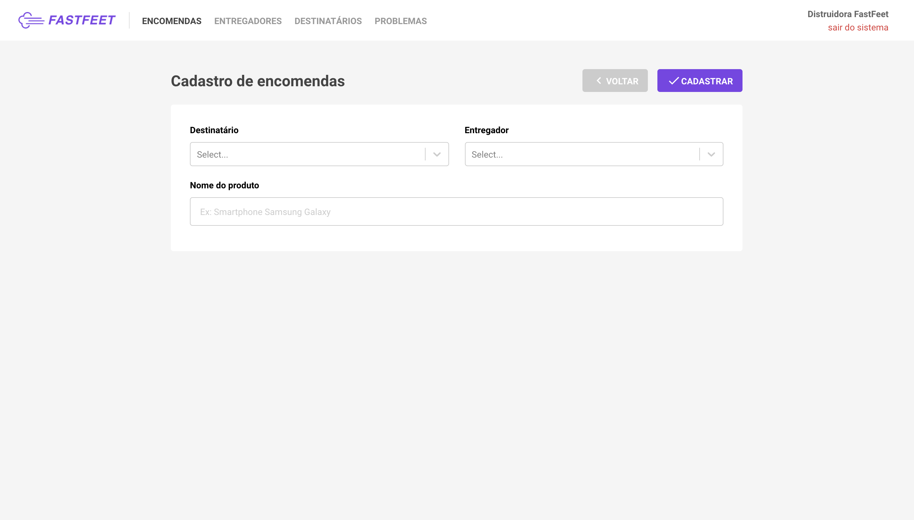
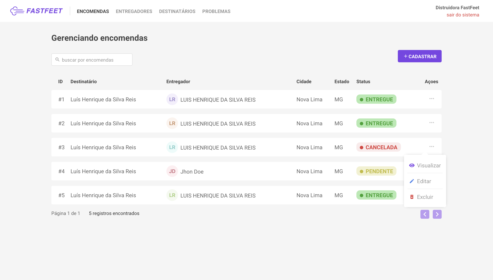
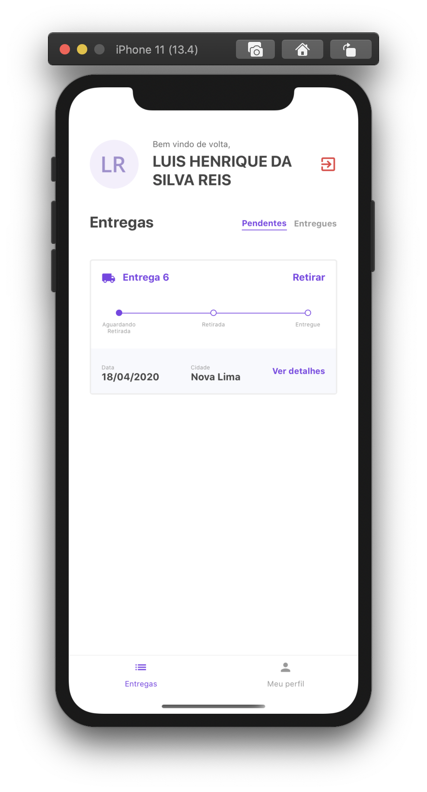
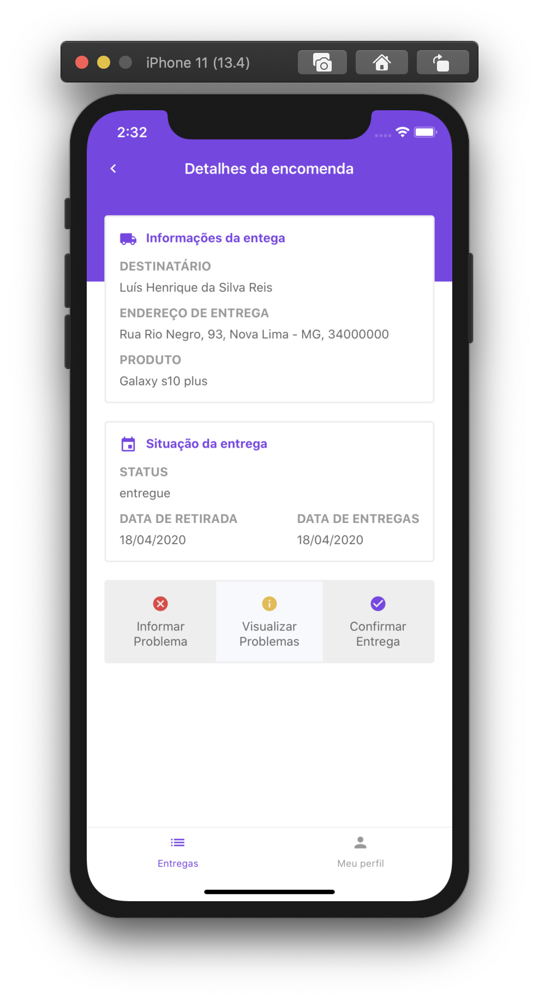
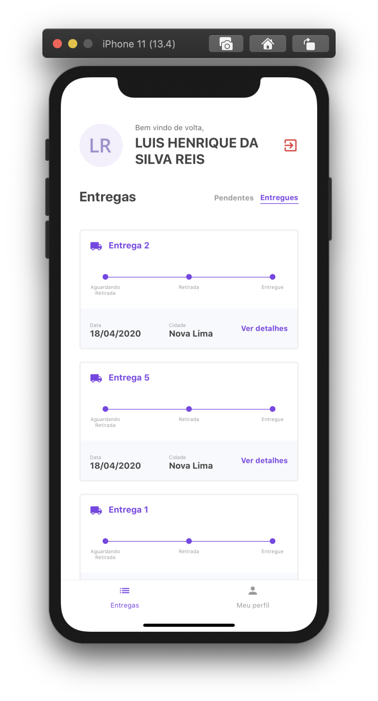
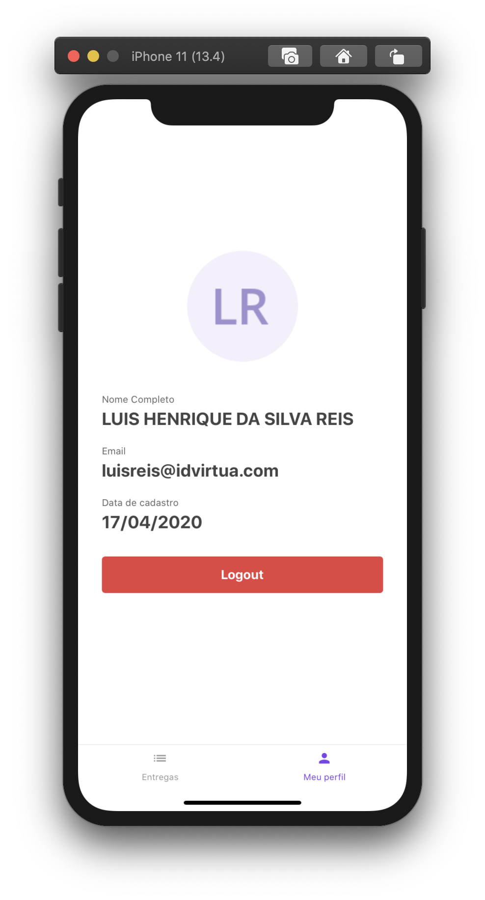

<h1 align="center">
  
</h1>

<h3 align="center">
  Desafio Final: FastFeet (Backend, FrontEnd e Mobile)
</h3>


# Instruções para executar a aplicação.

Faça o download do repositório e siga as instruções:

## Ambiente 

Este procedimento foi testado usando o MacOS e o emulador IOS.

Para criação das bases de dados foi utilizado o docker. Com o docker configurado na sua máquina, abra o terminal e rode os seguintes comandos

Nesse caso criei com a senha docker, mas você pode alterar a senha, e configurá-la depois no arquivo .env na raiz do backend;

```
  docker run --name fastfeetDataBase -e POSTGRES_PASSWORD=docker -p 5432:5432 -d postgres
```
Utilize o postbird para se conectar ao postgress e crie uma base de dados com o nome fastfeet (Você pode utilizar outro nome, mas lembre de alterar no arquivo .env);

Agora vamos criar a base redis para tarefas de envio de emails.

```
  docker run --name redisFastFeet -p 6379:6379 -d -t redis:alpine 
```

## Backend

duplique o arquivo .env.example que se encontra na raiz da pasta backend salve com o nome .env e preencha as variáveis de acordo com a configuração utilizada na preparaçÃo do ambiente.

utilizando o terminal acesse a pasta backend e rode o seguinte comando para instalar as dependências do projeto.

```
  yarn
```
Para criação das tabelas utilize o comando:

```
yarn sequelize db:migrate
```

Para criar um usuário administrador padrão utilize o comando abaixo. Esse comando vai criar um usuário com o email `admin@fastfeet.com` e senha `123456`. Caso queria um usuário e senha diferentes configure na pasta /src/database/seeds.

```
yarn sequelize db:seed:all
```

É hora de subir o servidor rode o seguinte comando na raiz da pasta backend:
```
yarn dev
```

Agora vamos subir o servidor responsável pelo gerenciamento de filas de envio de emails. Abra uma nova janela do terminal e na raiz da pasta backend rode:

```
yarn queue
```

Pronto o backend já está pronto para o uso, agora vamos para a parte web da aplicação.

### Opcionais desenvolvidos no backend

 - Paginação para todas as listagens

### tecnologias aprendidas e aplicadas

- Node
- Express
- Sequelize
- Docker
- Redis
- Bequeue
- Nodemailer
- handlebars
- eslint
- prettier
- nodemon


## WEB

Rode o seguinte comando na raiz da pasta frontend para instalar as dependencias

```
  yarn
```
Agora para iniciar a aplicação WEB basta rodar:

```
  yarn start
```

A aplicação vai se iniciar na tela de login. Faça login com user e senha criados via seeds no processo excutado anteriormente no backend

### Opcionais desenvolvidos no sistema web

 - Todas as listagem possuem paginação e filtro
 - Se o entregador for cadastrado sem foto. Será gerado uma imagem com as iniciais dele utilizando a api https://ui-avatars.com/

### tecnologias aprendidas e aplicadas

- ReactJS
- eslint
- prettier
- redux
- redux-saga
- redux-persist
- styled-components

## Mobile

Acesse a pasta mobile e rode o seguinte comando para instalar as dependências

```
  yarn
```
Agora para instalar os pods ( Apenas para IOS ) rode

```
cd ios && pod install && cd ..
```

Agora basta iniciar a aplicação 

```
react-native run-ios
```

### Opcionais desenvolvidos no mobile

- A opção de retirar a encomenda eu coloquei no canto superior direito do card da encomenda, na listagem das encomendas como se pode ver na primeira imagens das capturas de tela ao final desse documento.
- Toast. Desenvolvi um Toast inspirado no toastfy usado na web. O Toast foi adicionado no index do projeto.

```
<Provider store={store}>
  <PersistGate persistor={persistor}>
    <Toast duration={4000} />
    <StatusBar barStyle="light-content" backgroundColor="#7D40E7" />
    <Routes />
  </PersistGate>
</Provider>

```

As mensagens são disparadas usando o dispatch do react-redux ou o put do redux-saga

```
yield put(
  showToast('error', 'erro ao fazer login, usuário não encontrado')
);
```
```
dispatch(
  showToast(
    'error',
    'Erro ao tentar fazer o upload da imagem, tente novamente mais tarde'
  )
);
```


<h1 align="center">
  
</h1>

### tecnologias aprendidas e aplicadas

- React Native
- eslint
- prettier
- redux
- redux-saga
- redux-persist
- styled-components

## Capturas de algumas telas da solução


<div>




<div>


## 📝 Licença

Esse projeto está sob a licença MIT. Veja o arquivo [LICENSE](LICENSE.md) para mais detalhes.

---

Feito com ♥ by Luis Reis :wave: Tks to Rocketseat 